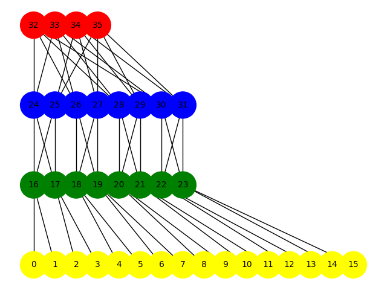

# Fat-Tree Topology (k=4 / k=8) — Python + NetworkX

This repo implements a classic fat-tree datacenter topology and explores shortest paths between hosts using NetworkX. It contains two small scripts aligned with a two-phase class assignment.

  

## Features
- Phase 1 (k=4): builds the fat-tree graph, exports the link table to `data/fat_tree.csv`, and draws a layered visualization.
- Phase 2 (k=8): builds the fat-tree graph and exports **all shortest simple paths** between two input nodes to `data/all_shortest_paths.csv`.

## Project structure
